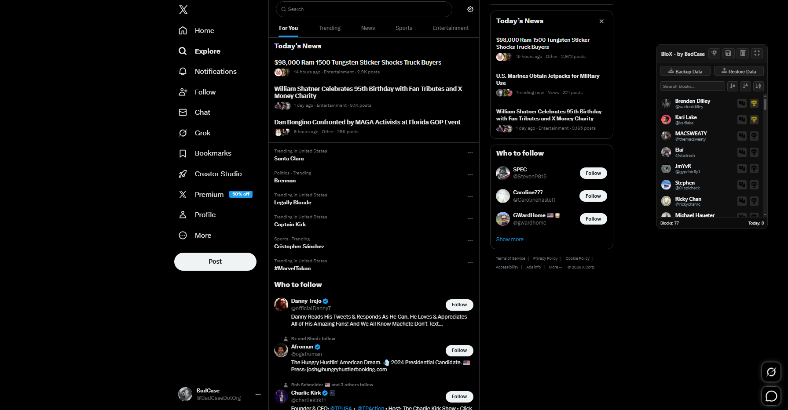
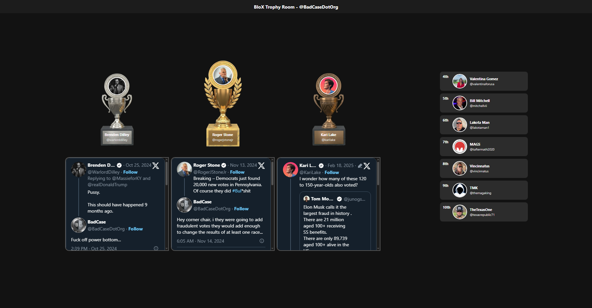
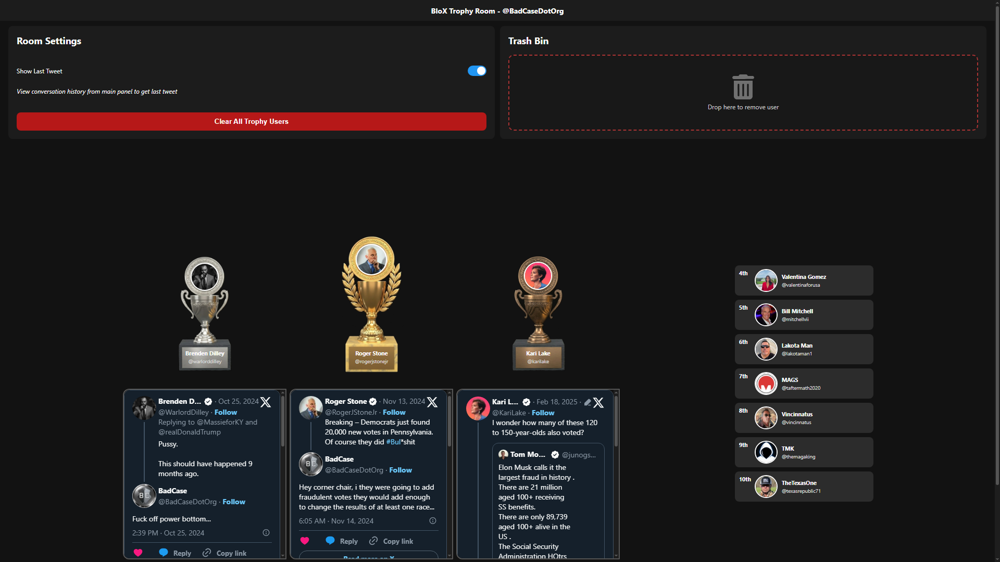
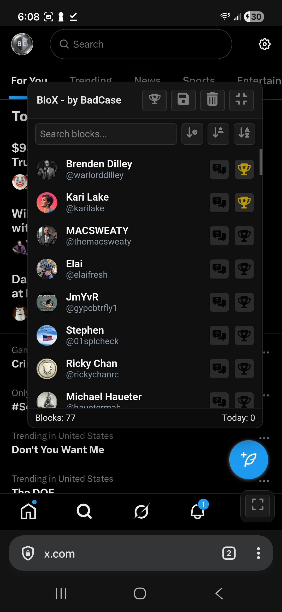
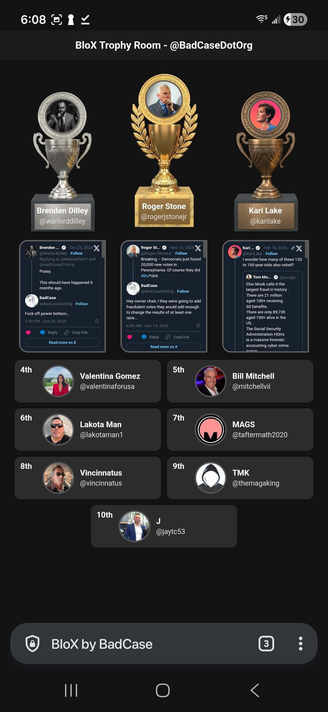
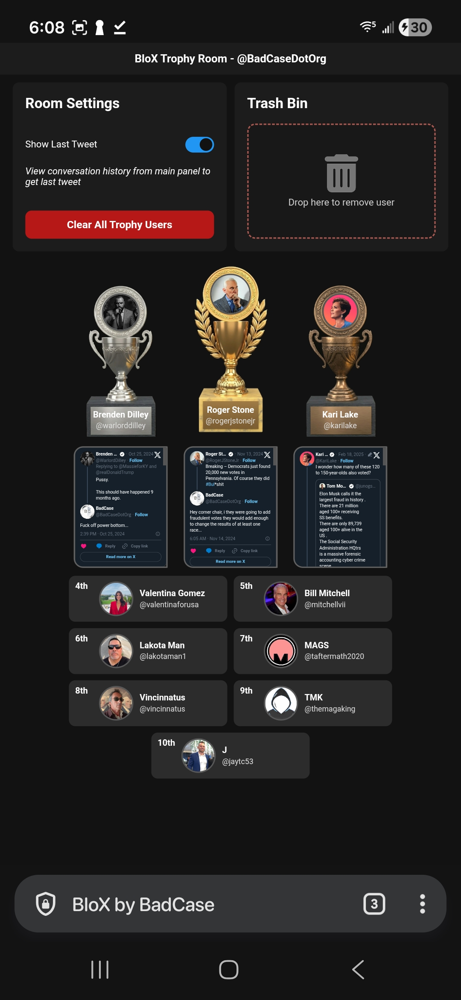

# BloX Browser Extension

 <!-- Replace with your actual icon path -->

**BloX** is a browser extension that tracks and showcases users who have blocked you on X (formerly Twitter). It provides a **dark-mode interface**, a Trophy Room for your top blockers, and tools to backup and restore your blocker data.  

---

## 📖 Table of Contents

- [Key Features](#key-features)  
- [Screenshots](#screenshots)  
- [Installation](#installation)  

---

## Key Features

- Tracks users when a comment from a blocker is encountered  
- Lookup conversation history with blockers  
- Add blockers to the **Trophy Room** to showcase top 10 blocks  
- Backup and restore your blocker list and Trophy Room  
- Works on both desktop and mobile browsers  

---

## Screenshots

**Main Panel (Desktop)**  

**Trophy Room (Desktop)**  

**Trophy Room with Settings (Desktop)**  

**Main Panel (Mobile)**  

**Trophy Room (Mobile)**  

**Trophy Room with Settings (Mobile)**  

---

## Installation

### Chrome Desktop

1. Download the latest ZIP release from [Releases](https://github.com/BadCaseDotOrg/BloX/releases)  
2. Open Chrome and navigate to `chrome://extensions/`  
3. Enable **Developer mode** (toggle top-right)  
4. Click **Load unpacked** and select the extracted folder from the ZIP  

